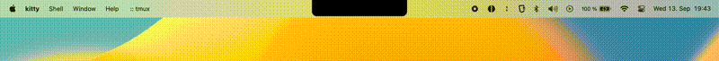

# Dynamic Island on macOS using SketchyBar

Dynamic Island on iPhone 14 Pro implementation on Mac using SketchyBar

***This project is yet to be used daily and be functional. It's more of a concept.***


DEMO
====



Table of Contents
=================

[Installation](#installation)

[Updating](#updating)

[Uninstallation](#uninstallation)

[Optimal Setup](#optimal-setup)

[Configuration](#configuration)

[Features](#features)

[Todo](#todo)

[Bugs](#bugs)

[FAQ](#faq)

[Credits](#credits)

Installation
============

### Requirements

- [Homebrew](https://brew.sh/)
- [SketchyBar](https://github.com/FelixKratz/SketchyBar)
- sf-symbols (`brew install --cask sf-symbols`)
- jq (`brew install jq`)

For music island to work properly you need the following additional requirements

- [cava](https://github.com/karlstav/cava) (`brew install cava`)
- [Background Music](https://github.com/kyleneideck/BackgroundMusic) (`brew install --cask background-music`)

### Getting Started

This program utilizes the "Multiple Bars" feature from SketchyBar. Symlink the SketchyBar binary with a different name and clone the repository inside `~/.config/dynamic-island-sketchybar`

```bash
ln -s $(which sketchybar) $(dirname $(which sketchybar))/dynamic-island-sketchybar && git clone https://github.com/crissNb/Dynamic-Island-Sketchybar.git ~/.config/dynamic-island-sketchybar
```

Now a `userconfig.sh` file must be copied to `~/.config/dynamic-island-sketchybar/` directory. This can be done by copying an appropriate config file for your machine.

E.g. for 2021 MacBook Pro 14 Inch:

```bash
cp ~/.config/dynamic-island-sketchybar/userconfigs/mbp2021_14.sh ~/.config/dynamic-island-sketchybar/userconfig.sh
```

The file must be called `userconfig.sh` and located right under dynamic-island-sketchybar directory for dynamic island to function.

Finally, the Dynamic Island can be opened via

```bash
dynamic-island-sketchybar
```

NOTE: There appears to be a bug that dynamic island helper program does not run the first time it is installed (after restarting sketchybar). If this is the case, simply restart the program.

If you'd like to have the `dynamic-island-sketchybar` run automatically, then have the command at the end of `sketchybarrc`.

##

Updating
=============

Just go into the `dynamic-island-sketchybar` directory and pull the changes from this repository.

```bash
cd ~/.config/dynamic-island-sketchybar
git pull
```

Uninstallation
==============

Uninstalling this project can be done by removing the symlink and the config folder (this repository).

```bash
rm $(which dynamic-island-sketchybar)
rm -r ~/.config/dynamic-island-sketchybar/
```

This will remove dynamic-island-sketchybar. Note that this will not remove sketchybar (see sketchybar documentation for sketchybar uninstallation guide).

Configuration
=============

All Dynamic Island configuration can be done in `~/.config/dynamic-island-sketchybar/userconfig.sh`. There are `userconfig.sh` presets created in `~/.config/dynamic-island-sketchybar/userconfigs/`, so copy the appropriate config for your machine during installation for best results.

By default, dynamic island will take input from Apple Music. If you would like to use Spotify instead, change `P_DYNAMIC_ISLAND_MUSIC_SOURCE` variable in `userconfig.sh` to "Spotify" instead.

As of right now, users need to manually adjust the notch size in pixels. If you have found an optimal notch size for MacBook with a notch, please let me know. Once enough data has been gathered, preset system will be implemented.

### Disabling features

Set the option for the island you want to disable to `0` in your `userconfig.sh`

```bash
P_DYNAMIC_ISLAND_MUSIC_ENABLED=0
P_DYNAMIC_ISLAND_APPSWITCH_ENABLED=0
P_DYNAMIC_ISLAND_NOTIFICATION_ENABLED=0
P_DYNAMIC_ISLAND_VOLUME_ENABLED=0
```

Notifications are disabled by default.

You need to restart sketchybar service in order for the changes to take effect.

### Screen resolutions
In order for the dynamic island to properly scale with your monitor's resolution, you need to specify your monitor's resolution manually by changing `P_DYNAMIC_ISLAND_MONITOR_HORIZONTAL_RESOLUTION` variable in `userconfig.sh`. If you are using an external 1080p monitor, you would set this value to the following:

```bash
P_DYNAMIC_ISLAND_MONITOR_HORIZONTAL_RESOLUTION=1920
```

In case of built-in display, it must be divded by 2, e.g.: MBP 14 has 3024 resolution, so 3024/2=1512.

Features
========

The following is a list of features that this dynamic island project (working islands) has. Some islands do not work properly just yet. Thus, you may experience some glitches when using them.

- General Notifications (experimental)

- Volume/Brightness

- Music

- Pause/Resume

- App Switch

- Power Source

- WIFI

Enabling notifications may have performance impact.
Music island saves the artwork 'temporarily' (this artwork file is then replaced with a newer artwork file, if requested) to display it on the dynamic island. It also creates a cache file.

### Recommended Features

For "general notifications" feature, I suggest you to turn on the "Do Not Disturb" on your macOS settings. This way the notifications will only be shown via the dynamic island.

If you would like to purely rely on the dynamic island interface for your volume and brightness levels, type the following command in terminal:

```bash
launchctl unload -F /System/Library/LaunchAgents/com.apple.OSDUIHelper.plist
```

This requires you to disable system integrity protection (SIP).

Todo
====

- Code cleanup for notification helper
- Make GitHub Wiki
- Hide the notch on non-notched laptops

### Upcoming Features / Upcoming Islands

- Lock / Unlock
- Bluetooth status
- Do not disturb
- ...and more!

Bugs
====

If you encounter any bugs, feel free to open up an issue!

Contributing
============

Pull requests are also welcome.

##

The following terms/system may be relevant when looking at the code:

There are mainly three parts of this implementation of dynamic island: `dynamic island item`, `dynamic island helper` (written in C, communicates with sketchybar) and `island scripts` (written in shell script)

The dynamic island has its own event items. These event items are subscribed to sketchybar's specific events, e.g. "volume event", "brightness event", etc. These event items will cast a trigger called `dynamic_island_queue` with environment variables provided (details).

The `dynamic island helper` receives a trigger `dynamic_island_queue` and processes the islands in a queue (first come, first serve). An item from the queue gets removed when the dynamic island item is not handling any islands.
To remove an item from the dynamic island queue, the dynamic island helper program calls another trigger, `di_helper_listener_event` with environment variables that describe the island (i.e. identifier of the island, args). This event will then call `process.sh`, which will then call the correct island from `island scripts` depending on the environment variables provided.

The `island scripts` also contain delays and get automatically reset (`reset.sh`) after a set amount of duration. After `reset.sh` script runs, the island item's process is finished.

When an island item finishes its process, it tells the helper program to process the next item in the queue.

Tested devices
==============

- 2021 MacBook Pro 14

FAQ
===

**Q:** Can I use this on MacBook without a notch?

**A:** Yes, it should work, using this config will create a notch on your device.

##

**Q:** Can I use this with multi monitors?

**A:** It's possible. You can either configure it to show in specific displays (e.g. main display) or all displays. However, unexpected results might occur if you attempt to use this project with multiple monitors of different resolutions.

##

Credits
=======

Base sketchybarrc was taken from FelixKratz's [dotfiles](https://github.com/FelixKratz/dotfiles).

Base visualizer config was taken from @ColaMint
