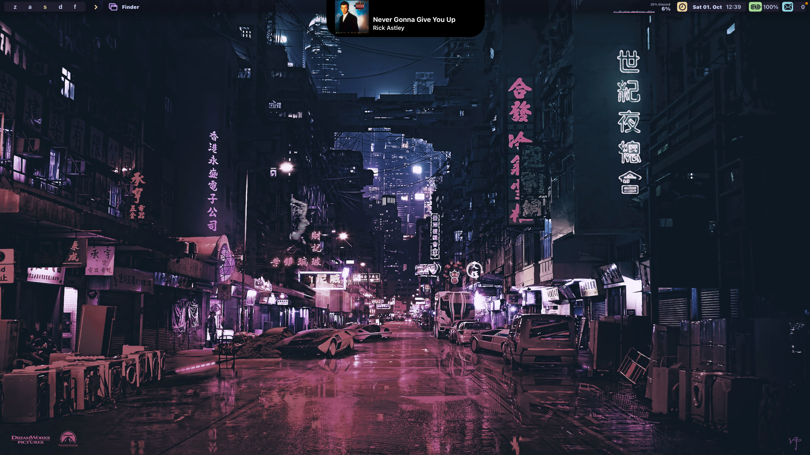
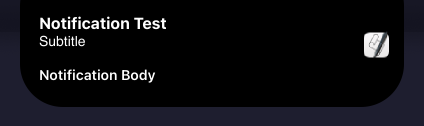
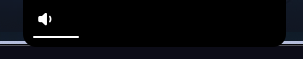
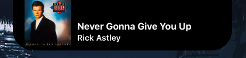

# Dynamic Island on macOS using SketchyBar
Dynamic Island on iPhone 14 Pro implementation on Mac using SketchyBar

***NOTE: Majority of the code are hardcoded. This is my first time making a project using Shell Scripts. Some features require constantly rewriting a file instead of relying on a event system. With that being said, I have yet experienced a large impact on performance on my machine.***
***This project is yet to be used daily and be functional. It's more of a concept.***



Table of Contents
=================

[Installation](#installation)

[Updating](#updating)

[Optimal Setup](#optimal-setup)

[Configuration](#configuration)

[Features](#features)

[Todo](#todo)

[Bugs](#bugs)

[FAQ](#faq)

[Credits](#credits)


Installation
============

### Requirements
- [Homebrew](https://brew.sh/)
- [SketchyBar](https://github.com/FelixKratz/SketchyBar)
- sf-symbols (`brew install --cask sf-symbols`)
- biplist (`pip3 install biplist`) (only required for notification feature)

### Getting Started (If you're not using SketchyBar already)
1. Clone the repository inside `~/.config/sketchybar/plugins`, take the default `sketchybarrc` and restart `sketchybar`,
```bash
mkdir -p ~/.config/sketchybar/plugins
cd ~/.config/sketchybar/plugins
git clone https://github.com/crissNb/Dynamic-Island-Sketchybar.git
mv Dynamic-Island-Sketchybar/sketchybarrc.example ../sketchybarrc
brew services restart sketchybar
```

##

### For existing SketchyBar users
Add this line of code to the beginning of your `sketchybarrc` file.
```bash
PLUGIN_DIR="$HOME/.config/sketchybar/plugins"
source "$PLUGIN_DIR/Dynamic-Island-Sketchybar/config.sh"
```
Add this line of code alongside your other items
```bash
source "$PLUGIN_DIR/Dynamic-Island-Sketchybar/item.sh"
```

You can to adjust default settings with `sketchybar --default`.
See `sketchybarrc.example` of this repository for example on how to set up Dynamic-Island-Sketchybar.

Updating
=============
Just go into the `Dynamic-Island-Sketchybar` and pull the changes.
```bash
cd ~/.config/sketchybar/plugins/Dynamic-Island-Sketchybar
git pull
```

Optimal Setup
=============
I highly suggest you to use SketchyBar and the dynamic island config files with Yabai.

If you have been using the macOS's default menu bar, I suggest you to enable the `"Automatically hide and show the menu bar"` option (located in `System Preferences -> Dock & Menu Bar`) and completely relying on the SketchyBar to handle the macOS menu. This repository only includes the SketchyBar configuration for Dynamic Island plugin. See my [dotfiles](https://github.com/crissNb/dotfiles) or [Sketchybar setups](https://github.com/FelixKratz/SketchyBar/discussions/47) for preconfigured SketchyBar setups to fully replace macOS menu bar.
*If you are using my dotfiles for sketchybar, dynamic island is already included in the dotfiles. Otherwise, you will need to repeat the process above. Also see ["For existing SketchyBar users"](#for-existing-sketchybar-users).

Configuration
=============
Copy `~/.config/sketchybar/plugins/Dynamic-Island-Sketchybar/userconfig.sh` to `~/.config/sketchybar/userconfig.sh`.

You can see all the default values included in the file already, you can delete the options you don't want to modify

As of right now, users need to manually adjust the notch size in pixels. If you have found an optimal notch size for MacBook with a notch, please let me know. Once enough data has been gathered, preset system will be implemented.

The default configuration values are meant for 2021 MacBook Pro 14.

### Disabling features
Set the option for the island you want to disable to `0` in your `userconfig.sh`
```bash
P_DYNAMIC_ISLAND_MUSIC_ENABLED=0
P_DYNAMIC_ISLAND_APPSWITCH_ENABLED=0
P_DYNAMIC_ISLAND_NOTIFICATION_ENABLED=0
P_DYNAMIC_ISLAND_VOLUME_ENABLED=0
```

Features
========
The following table describes the capabilities of this dynamic island project (working islands). Some islands do not work properly just yet. Thus, you may experience some glitches when using them.

|               | General Notifications | Volume  | Music | Pause/Resume | App Switch |
| ------------- |:-------------:| :-----: | :---------: | :------: | :--------: |
| **Cache File**      | yes | yes | yes* | yes | no |
| **Event System?**      | no      |   no | yes | yes | yes |
| **How well does it work?** | 5/5      |    3/5 | 5/5 | 3/5 | 5/5 |
| **Known Bugs** | None | - Animation bug when volume changes multiple times while the UI is active | None | - Animation bug when play / pause happens multiple times while the UI is active | None |
| **Screenshot** |  |  |  |  |  |

*saves the artwork temporarily to display it on the dynamic island.

Some features (islands) rely on a script that gets called every second instead of using NSDistributedNotficationCenter. In other words, these islands will have slower response times compared to those using the event system.

Some features (islands) rely on making a "cache" file inside of a SketchyBar config directory.

### Recommended Features
*For the best experience, I suggest you to use the following features (for now):*
- General Notifications
- Music
- App Switch

For General Notification feature, I suggest you to turn on the "Do Not Disturb" on your macOS settings. This way the notifications will only be shown via the dynamic island.

Todo
====
- Make GitHub Wiki
- Hide the notch on non-notched laptops
- Less hardcoded system...

### Upcoming Features / Upcoming Islands
- Lock / Unlock
- Bluetooth status
- Do not disturb
- ...and more!

Bugs
====
If you encounter any bugs, feel free to open up an issue! Pull requests are also welcome

Tested devices
==============
- 2021 MacBook Pro 14

FAQ
===
**Q:** Can I use this on MacBook without a notch?

**A:** Yes, it should work, using this config will create a notch on your device.
##

**Q:** Can I use this with multi monitors?

**A:** It's possible, but there will be a notch on all displays. The dynamic island will only appear on one active display, though. This project is not intended to be used with multiple monitors.
##

Credits
=======
Base sketchybarrc was taken from FelixKratz's [dotfiles](https://github.com/FelixKratz/dotfiles).

[Python script](https://github.com/ydkhatri/MacForensics) to get all notifications from the macOS's database.
